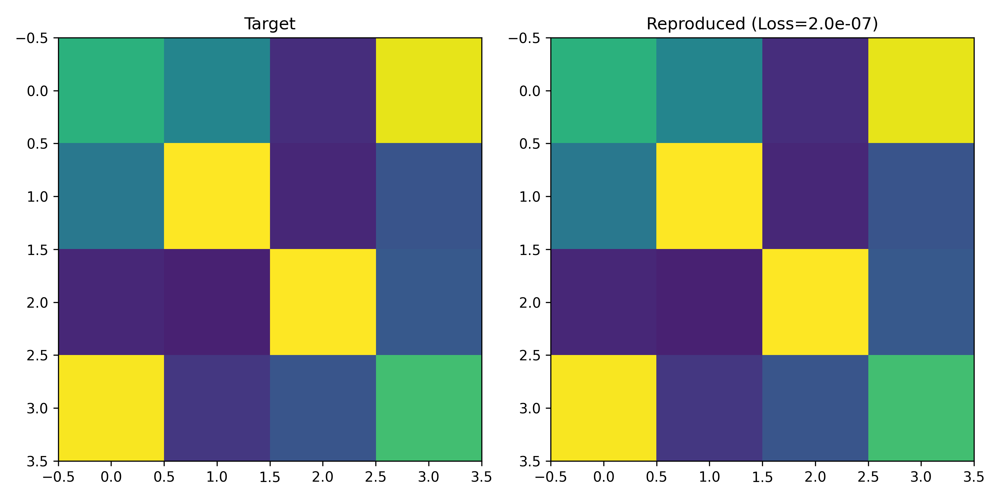

# Optical Matrix Universality Verification
**Proof of Universal Unitary Matrix Reproduction using 4x4 MZI Mesh.**

## �� Overview
This project validates the **mathematical universality** of the photonic mesh architecture used in our "DiffPhoton" simulator.
Before applying the circuit to AI tasks, we verified whether it can physically reproduce **any arbitrary random unitary matrix** without error.

## 🔬 Experiment Setup
- **Target**: Random 4x4 Unitary Matrices (Haar-random).
- **Architecture**: 6-MZI Triangular Mesh (Reck/Clements design).
- **Control Parameters**: **16-DOF** (Degrees of Freedom).
    - Internal Phase Shifters ($\theta, \phi$): 12 params
    - Output Phase Adjusters: 4 params
- **Optimization**: Gradient descent via JAX/Optax.

## 📊 Key Result: Perfect Reproduction
Initially, a 10-DOF setup failed to converge (Loss $\approx$ 0.67). 
By upgrading to a full **16-DOF configuration** (matching the mathematical degrees of freedom of a 4x4 unitary group), we achieved **near-zero loss**.

- **Final Loss**: **$2.0 \times 10^{-7}$** (Virtually Zero)
- **Conclusion**: The device works as a **perfect Universal Linear Processor**.

## 🛠 Technology Stack
- **Language**: Python 3.10+
- **Engine**: Google JAX (Complex-valued matrix differentiation)
- **Optimizer**: Optax (Adam)

## 👨‍💻 Author
**Optical Matrix Verification Project**
(Part of Hybrid Optical Neural Network Research)
